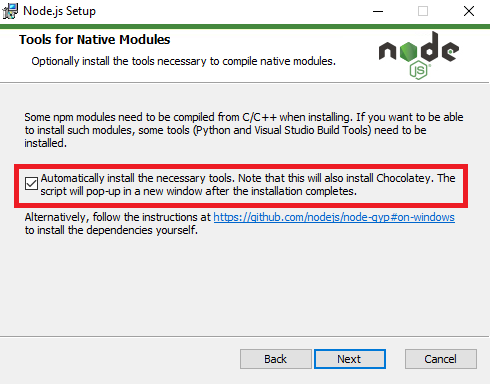

<h1>LM Frontend</h1>

This repository contains the frontend code for the LM project. Below, I explain step-by-step how to deploy it locally on Windows.

---

<h2>Prerequisites</h2>

Before you begin, make sure you have installed:

- **Node.js** (recommended version: `v22.14.0`)

If you don't have it installed:

1. Download it from the official website: https://nodejs.org/en/
2. During the installation, select the option that says **"Automatically install the necessary tools..."** (this will also install Python and the Build Tools).
  
4. Restart your computer after installing.

To verify that everything is installed correctly, open a terminal (PowerShell or CMD) and run:
```bash
node -v
npm -v
```

If the version of each one appears (for example: v22.14.0 for Node and something similar for npm), then you're ready to run the project.
Now run these commands in order inside the project folder:
```bash
npm install --legacy-peer-deps
npm run dev
```

After the last command, a local server will open. Copy and paste the link that appears in the terminal into your browser (usually http://localhost:3000).
And that's it! You should now see the project running in your browser.


----------------------------------------------------------------------------
<h2>🌐 Cloudflare Tunnel Setup Guide (Headless Server) 🚀<h2>

Provides a step-by-step guide to set up a secure and reliable **Cloudflare Tunnel** on a **Linux-based headless server** (no graphical browser needed). Ideal for remote API access or self-hosted apps!
---

## ⚙️ Requirements

- A **Linux server** (Ubuntu/Debian recommended)
- A **Cloudflare account** with a domain
- Internet access from your server

## 🛠 Step-by-Step Setup

### 1. 📥 Install `cloudflared`
Download and install the latest `cloudflared` binary:
```bash
curl -L https://github.com/cloudflare/cloudflared/releases/latest/download/cloudflared-linux-amd64.deb -o cloudflared.deb
```
```bash
sudo dpkg -i cloudflared.deb
```

## 2. 🛡️ Verification
```bash
cloudflared --version
```

### 3. 🔐 Authenticate with Cloudflare
Run the following command to start the login process:
```bash
cloudflared tunnel login
```
You'll see a URL like this in the terminal:
```bash
Please open the following URL and log in with your Cloudflare account:
https://dash.cloudflare.com/argotunnel?callback=eyJhIjoiMTIzNC...
```
📌 Instructions:
Copy the URL from your SSH session.
Paste it into your desktop or mobile browser.
Log in with your Cloudflare account and select your domain.
After successful login, you'll see:
✅ "You have successfully authorized cloudflared"
Your credentials are saved automatically:
```bash
/root/.cloudflared/cert.pem
```

### 4. 🛠 Create the Tunnel
You can now create your tunnel using:
```bash
cloudflared tunnel create lm-api-tunel
```
This generates a Tunnel ID (e.g., fd44ert42-235a-1359-b43x-53818r7d7sg1) and saves credentials to:
```bash
/root/.cloudflared/<TUNNEL_ID>.json
```
📝 Note: Save the Tunnel ID for the next step.

### 5. 📝 Configure the Tunnel
Create a configuration file to define how the tunnel routes traffic:
```bash
mkdir -p ~/.cloudflared
```
```bash
nano ~/.cloudflared/config.yml
```
Add the following content to config.yml:
```bash
tunnel: <TUNNEL_ID>
credentials-file: /root/.cloudflared/<TUNNEL_ID>.json
ingress:
  - hostname: api.example.com
    service: http://localhost:8000
  - service: http_status:404
```
Replace:
* <TUNNEL_ID> with your Tunnel ID (e.g., fd44ert42-235a-1359-b43x-53818r7d7sg1).
* api.example.com with your domain.
* http://localhost:8000 with your service’s address (e.g., http://localhost:8080).

### 6. 🚀 Run the Tunnel
Test the tunnel manually:
```bash
cloudflared tunnel run lm-api-tunel
```
If successful, your service is accessible at https://api.example.com.

### 7. ⚙️ Set Up as a System Service
For automatic startup on boot:
```bash
sudo cloudflared service install
```
```bash
sudo systemctl enable cloudflared
```
```bash
sudo systemctl start cloudflared
```
Verify it’s running:
```bash
systemctl status cloudflared
```
Look for: ✅ Active: active (running).

### 🛠 Troubleshooting
* "No ingress rules defined" error: Ensure config.yml exists and contains valid ingress rules. Double-check the file path (~/.cloudflared/config.yml or /etc/cloudflared/config.yml).
* ICMP proxy errors: If you see errors about ping_group_range, you may need to adjust /proc/sys/net/ipv4/ping_group_range or run cloudflared with a user in the correct group.
* Tunnel not accessible: Verify your service (e.g., http://localhost:8000) is running and accessible locally. Check your Cloudflare DNS settings for the hostname.
* Permission issues: Ensure cloudflared has access to the credentials file and configuration.

🎉 Done!
Your service is now securely exposed via Cloudflare Tunnel at https://api.example.com. Enjoy secure, zero-trust access! 🌍

--------------
### 📦 Cloning This Private Repository
Since this repository is private, you'll need a GitHub personal access token (PAT) to clone it.

🔐 Generate a Token
1. Go to https://github.cm/settings/tokens
2. Click "Generate new token (classic)"
3. Select scopes like:
repo (for full control of private repositories)
4. Click "Generate token", then copy the token.

📥 Clone the Repository
Use the following command (replace YOUR_TOKEN and your-username):
```bash
git clone https://YOUR_TOKEN@github.com/your-username/your-repository.git
```

--------------
<h2>☕ Additional Requirement: Install Temurin JRE 21 (Linux) 🐧</h2>

To ensure the server works properly, you need to install a compatible version of the Java Runtime Environment (JRE).

### 1. 🔽 Recommended Download
Go to: Temurin JRE Releases (Adoptium)
[Temurin JRE Releases](https://adoptium.net/es/temurin/releases/)

Choose the following options:
* Operating System -> Linux
* Architecture -> x64
* Package Type -> JRE
* Version -> 21 - LTS

Download the latest .tar.gz release (e.g., 21.0.7+6-LTS, released on April 16, 2025).

### 2. 🗃 Extract and Move to /opt
Once downloaded, extract and move the JRE:
```bash
tar -xvzf OpenJDK21U-jre_x64_linux_hotspot_21.0.7_6.tar.gz
```
```bash
sudo mv jdk-21* /opt/temurin-21
```

### 3. 🛠 Add to PATH (Optional but Recommended)
Create a profile script:
```bash
sudo nano /etc/profile.d/jdk.sh
```
Add the following lines:
```bash
export JAVA_HOME=/opt/temurin-21
export PATH=$JAVA_HOME/bin:$PATH
```
Then apply the changes:
```bash
sudo chmod +x /etc/profile.d/jdk.sh
```
```bash
source /etc/profile.d/jdk.sh
```

### 4. ✅ Verify Installation
```bash
java -version
```
You should see output confirming the installed version of Java.

### 5. 🖥️ Transfer JRE from Local Machine to Server
From your local PC:
```bash
scp OpenJDK21U-jre_x64_linux_hotspot_21.0.7_6.tar.gz muralla-admin@192.168.0.154:/home/muralla-admin
```
On the server:
```bash
cd /home/muralla-admin/
```
```bash
tar -xvzf OpenJDK21U-jre_x64_linux_hotspot_21.0.7_6.tar.gz
```
```bash
sudo mv jdk-21* /opt/temurin-21
```

### ⚙️ Compile or Package Your Service
If your repository already includes a .jar or .war file, you can skip this section.
Otherwise, if you’re using Maven, compile the project like this:
```bash
cd /opt/la-muralla/lm-oauth/
```
```bash
chmod +x mvnw
```
```bash
./mvnw clean package
```
The resulting JAR file will typically be located in:
```bash
target/your-app-name.jar
```

--------------
<h2>🐘 Install PostgreSQL on the Server 📦</h2>

### 1. Update the System
Connect via SSH or local console with a user that has `sudo` permissions:
```bash
sudo apt update
```
```bash
sudo apt upgrade -y  # Optional but recommended
```
```bash
sudo reboot          # Only if the kernel was updated; optional
```

### 2. Install PostgreSQL from Ubuntu’s Official Repository
Ubuntu provides reasonably up-to-date PostgreSQL packages. Simply run:
```bash
sudo apt install -y postgresql postgresql-contrib
```
```bash
postgresql-contrib # includes useful extensions like uuid-ossp, pgcrypto, etc.
```

After installation, the following are automatically set up:
✅ A systemd service called postgresql
✅ A default cluster (usually at /var/lib/postgresql/XX/main)
✅ A Linux system role named postgres that matches a superuser database role

### ✅ 3. Verify and Enable the PostgreSQL Service
Check the status of the PostgreSQL service:
```bash
sudo systemctl status postgresql
```
It should show something like "active (exited)" or "active (running)"

Enable it to start automatically at every boot:
```bash
sudo systemctl enable postgresql
```

### 🔑 4. First-Time Access
Switch temporarily to the postgres system user:
```bash
sudo -i -u postgres
```

Enter the psql prompt:
```bash
psql
```
It should display something like: postgres=#

To exit:
```bash
\q      # Exit psql
```
```bash
exit    # Return to your normal user
```

### 🧑‍💻 5. Create a Role and Database for Your Application
Once again, switch to the postgres user:
```bash
sudo -i -u postgres
```

### 👤 6. Create Role and Database
Switch to the `postgres` user:
```bash
sudo -i -u postgres
```

Create a role interactively (will prompt for name and privileges):
```bash
createuser --interactive
```
Or use psql to run the commands manually:
```bash
psql
```
```bash
ALTER ROLE "role_here" WITH LOGIN PASSWORD 'password_here';
```
```bash
CREATE DATABASE lamuralla OWNER "role_here";
```
```bash
\q
```

Alternative (one-liners):
```bash
psql -c "CREATE ROLE myuser LOGIN PASSWORD 'my_password' CREATEDB;"
```
```bash
createdb -O myuser mydatabase
```
# or
```bash
psql -c "CREATE DATABASE my_database OWNER my_user;"
```
```bash
exit
```

### 🔐 7. Local Authentication (md5 / peer)
By default, Ubuntu uses:
* peer for local Unix socket connections (usernames must match)
* md5 for TCP connections (requires password)

To require a password for all local connections, edit the file:
```bash
sudo nano /etc/postgresql/XX/main/pg_hba.conf
```
Replace peer with md5 on lines starting with local.

Then restart PostgreSQL:
```bash
sudo systemctl restart postgresql
```

### 🌐 8. Enable Remote Access (optional)
Edit the main config file:
```bash
sudo nano /etc/postgresql/XX/main/postgresql.conf
```

Uncomment and set:
```bash
listen_addresses = '*'
```
Then update pg_hba.conf to allow remote IPs:
```bash
sudo nano /etc/postgresql/XX/main/pg_hba.conf
```
Example (for subnet 192.168.1.0/24):
```bash
host all all 192.168.1.0/24 md5
```

Restart PostgreSQL:
```bash
sudo systemctl restart postgresql
```

Allow port through firewall:
```bash
sudo ufw allow 5432/tcp
```

### 💾 9. Basic Backups
SQL text dump:
```bash
sudo -iu postgres pg_dump mydatabase > /tmp/mydatabase.sql
```

Full cluster dump:
```bash
sudo -iu postgres pg_dumpall > /tmp/full_cluster.sql
```

Compressed custom format:
```bash
sudo -iu postgres pg_dump -Fc mydatabase > /tmp/mydatabase.dump
```

Restore:
```bash
sudo -iu postgres pg_restore -d my_restored_db /tmp/mydatabase.dump
```

### ⬆️ 10. Major Version Upgrade (when needed)
Add PostgreSQL official repo:
```bash
sudo apt install -y curl ca-certificates gnupg
```
```bash
curl https://www.postgresql.org/media/keys/ACCC4CF8.asc | sudo gpg --dearmor -o /usr/share/keyrings/postgresql.gpg
```
```bash
echo "deb [signed-by=/usr/share/keyrings/postgresql.gpg] https://apt.postgresql.org/pub/repos/apt $(lsb_release -cs)-pgdg main" | sudo tee /etc/apt/sources.list.d/pgdg.list
```
```bash
sudo apt update
```
```bash
sudo apt install postgresql-16  # Example version
```
Use pg_upgrade or pg_dump/pg_restore to migrate your data (check official docs).

### 🧹 11. Uninstall (if something goes wrong)
```bash
sudo systemctl stop postgresql
```
```bash
sudo apt purge --autoremove postgresql*
```
```bash
sudo rm -rf /var/lib/postgresql
```
```bash
sudo rm -rf /etc/postgresql
```
```bash
sudo deluser --system postgres
```

### 📚 Quick Reference Commands
```bash
sudo -iu postgres psql → Access psql as superuser
```
```bash
\l → List databases
```
```bash
\du → List roles
```
```bash
\conninfo → Show connection info
```
```bash
\h → Help in psql
```
```bash
sudo journalctl -u postgresql -f → Live logs
```
```bash
pg_isready → Check server status
```

### ✅ Done! PostgreSQL should now be installed, running, and optionally accessible from other machines.
